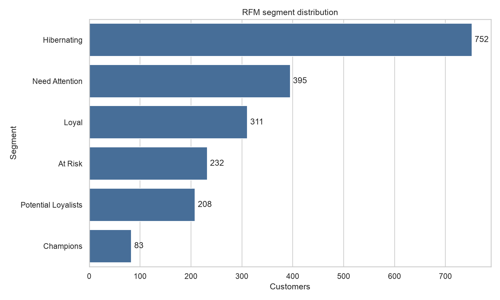
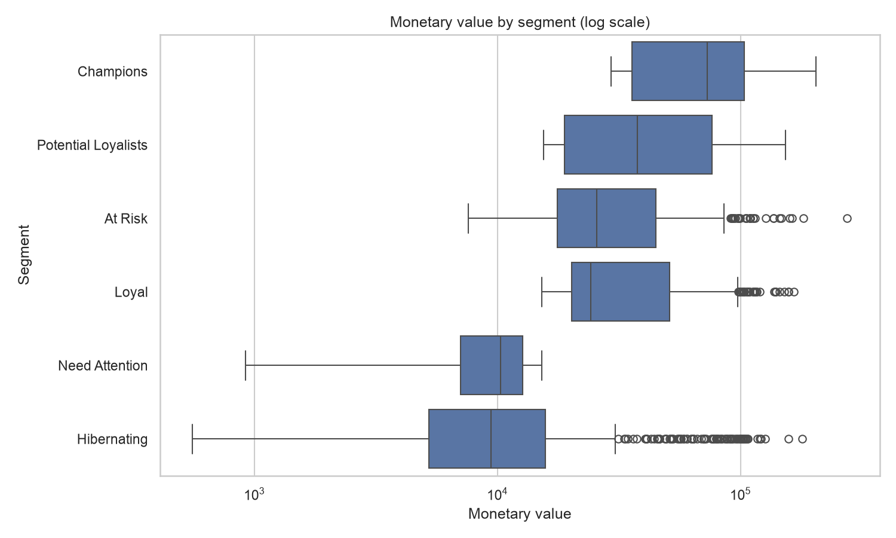
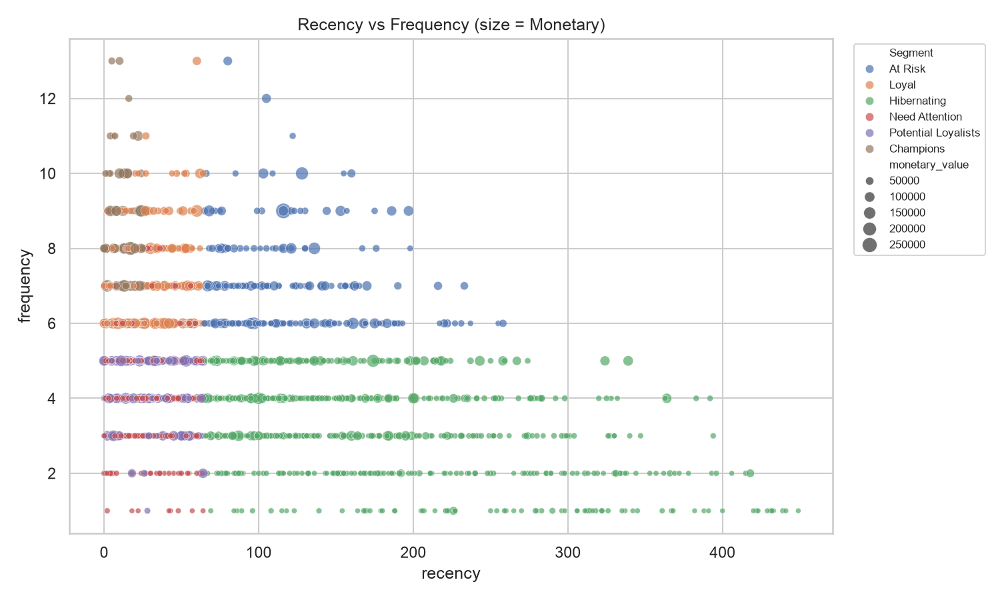
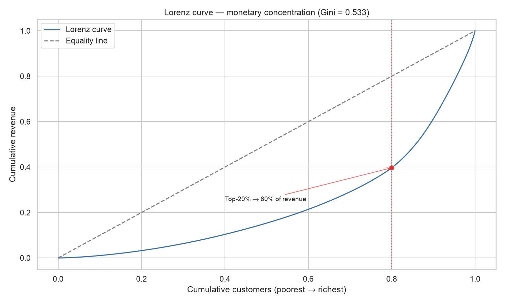
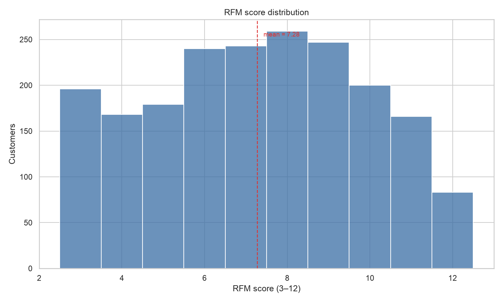
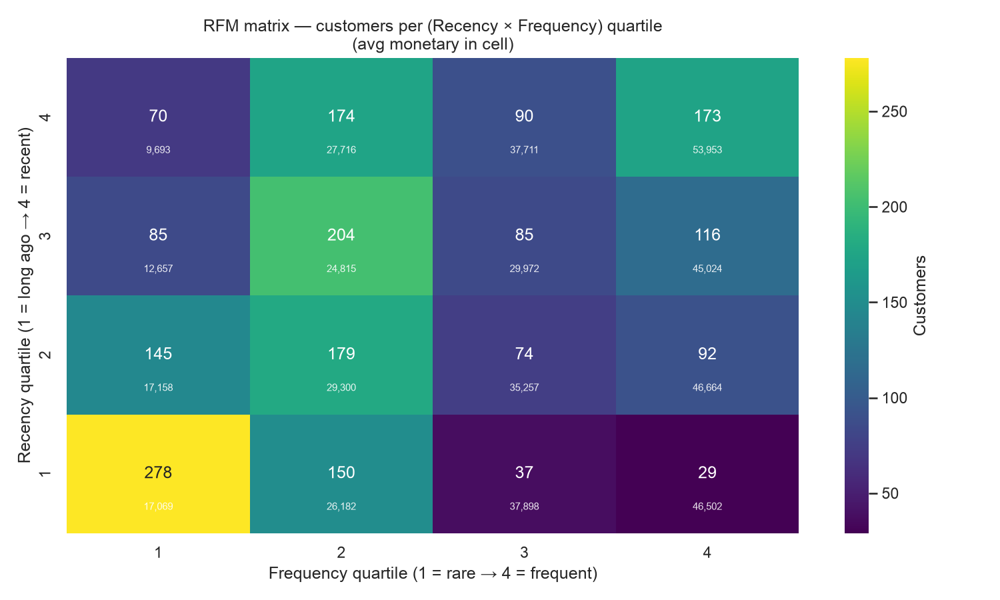
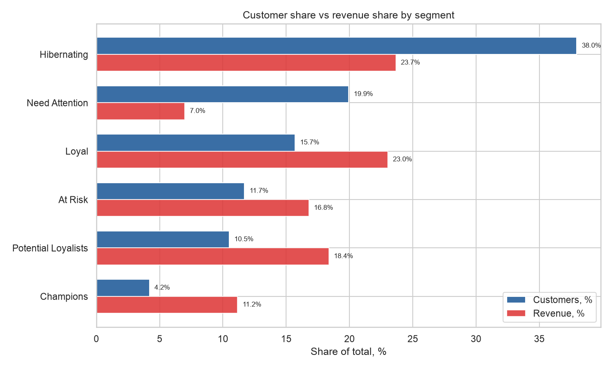
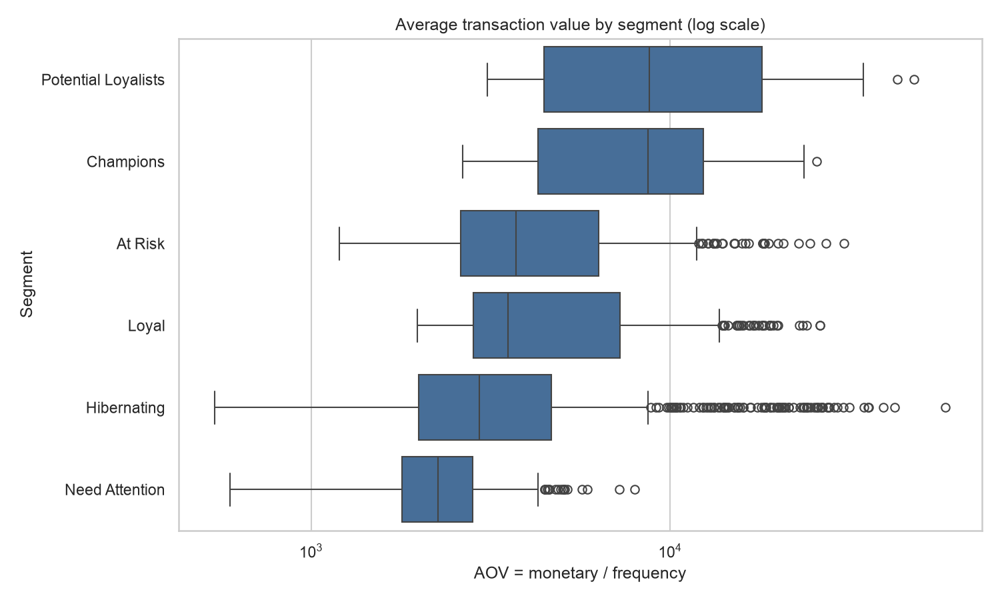
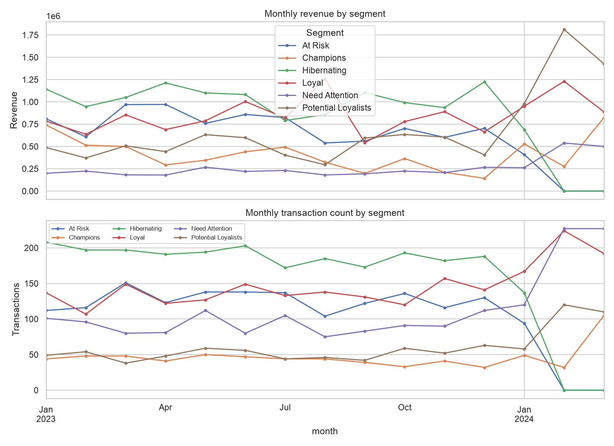

# RFM analysis of bank clients

Segment bank clients by transaction behavior using **Recency, Frequency, Monetary** scoring, then map quartile combos to named segments and export CSV + Excel + charts + an interactive dashboard.

## Background

Synthetic transaction log for 2,000 clients of a retail bank. The goal is to identify high-value clients, flag at-risk ones, and give marketing a targetable segment per customer.

- **Time period:** 2023-01-01 → 2024-04-01 (synthetic, reproducible via `generate_data.py`, seed 42)
- **Volume:** 10,000 transactions, ~1,981 unique active clients after anomaly drop
- **Schema:** `customer_id, transaction_date, amount, product_category, payment_method, is_anomaly`

## Quick start

```bash
uv sync --all-extras          # or: python -m venv .venv && pip install -r requirements.txt

python generate_data.py       # builds data/bank_rfm_dataset_10k_fixed.csv
python rfm_analysis.py        # writes data/rfm_output.csv, data/rfm_output_report.xlsx, images/*.png
python hypotheses.py          # runs the testable hypotheses over the RFM output
pytest                        # 18 unit tests on the pure pipeline functions
streamlit run dashboard/app.py   # interactive dashboard (5 tabs)
```

## Method

1. **Load & clean** — parse dates, drop rows flagged `is_anomaly == 1`.
2. **RFM table** — per `customer_id`: `recency` (days since last txn vs snapshot +1d), `frequency` (txn count), `monetary_value` (sum).
3. **Score quartiles 1..4** (higher = better):
   - `R_Quartile`: 4 = most recent, 1 = longest ago
   - `F_Quartile`: 4 = most frequent, 1 = rarest
   - `M_Quartile`: 4 = highest spend, 1 = lowest
   - `RFMClass`: 3-digit string (`444` = best, `111` = worst); `RFMScore` = sum (3..12)
4. **Segment** — combo-based (not sum-based), so `444` and `233` no longer share a bucket:

| Condition | Segment |
|---|---|
| R≥4 & F≥4 & M≥4 | Champions |
| R≥3 & F≥3 & M≥3 | Loyal |
| R≥3 & M≥3 | Potential Loyalists |
| R≤2 & F≥3 | At Risk |
| R≤2 & F≤2 | Hibernating |
| else | Need Attention |

5. **Concentration** — Lorenz curve + Gini coefficient verify segmentation has business sense; per-segment `concentration_ratio = revenue_share / customer_share` flags over/under-indexing.
6. **Export** — CSV (`data/rfm_output.csv`), formatted Excel (`data/rfm_output_report.xlsx`), charts (`images/`), interactive dashboard (`dashboard/`).

## Results

| Segment | Customers | Avg recency | Avg frequency | Avg monetary | Avg RFM |
|---|---:|---:|---:|---:|---:|
| Champions | 83 | 11.2 | 8.4 | 74,641 | 12.00 |
| Loyal | 311 | 29.1 | 7.1 | 40,997 | 10.41 |
| Potential Loyalists | 208 | 29.8 | 4.3 | 49,030 | 8.85 |
| At Risk | 232 | 115.9 | 7.0 | 40,172 | 8.43 |
| Need Attention | 395 | 29.1 | 4.3 | 9,816 | 7.01 |
| Hibernating | 752 | 171.5 | 3.2 | 17,459 | 4.81 |

**Monetary concentration:** Gini = 0.533 — Champions over-index on revenue (ratio 2.66), Hibernating under-indexes (ratio 0.62).

## Chart gallery

Every chart below follows the same reading order: **what it shows** (description) → the chart → **what it means** (insights).

### 1. Segment distribution

**Description.** Horizontal bar chart of customer counts per RFM segment, ordered from most to least populated. Answers the first portfolio question: how big is each cluster of the client base?



**Insights.**
- **Hibernating (752, 38%)** is the single largest pool — nearly 4 out of 10 clients sit in the low-engagement bucket.
- **Champions (83, 4%)** is tiny but strategically critical; **At Risk (232)** sits right next to it as the imminent-churn group.
- Combined, **At Risk + Hibernating ≈ 50% of the base** — the main re-engagement opportunity.

### 2. Monetary by segment

**Description.** Boxplot of lifetime monetary value per customer by segment (log scale), ordered by segment median. Shows where high spenders actually live.



**Insights.**
- **Champions and Potential Loyalists** have the highest medians and the widest right tails — value concentrates in exactly the segments scoring highest on R/F.
- **Need Attention** has the lowest spend distribution — many recent-but-small accounts with limited upside.
- The log-scale spread confirms heavy skew: within every segment a small minority dominates spend.

### 3. Recency vs Frequency (size = Monetary)

**Description.** Scatter of every customer by recency (days since last transaction) and frequency; point size encodes monetary value, color encodes segment. The canonical RFM map in one view.



**Insights.**
- **Champions** cluster in the low-recency / high-frequency corner (top-left); **Hibernating** fills the bottom-right.
- **At Risk** overlaps Hibernating on recency but keeps higher frequency — the clearest win-back target before they slide.
- Bubble size shows the long tail of high-monetary clients spread across several segments, not only Champions.

### 4. Lorenz curve — monetary concentration

**Description.** Cumulative share of revenue vs cumulative share of customers (poorest → richest). The distance from the equality diagonal is the inequality, summarized by the Gini coefficient.



**Insights.**
- **Gini = 0.533** — strongly unequal distribution of monetary value.
- **Top-20% of customers generate ~60% of revenue**, confirming the Pareto-like shape.
- Segmentation has business sense: a small share of clients drives the bulk of value, so targeting the right segment pays off disproportionately.

### 5. RFM score distribution

**Description.** Histogram of the composite RFM score (3–12) across all customers; dashed line marks the mean (7.28). A quick shape check of overall engagement health.



**Insights.**
- The distribution is roughly bell-shaped around a mean of **7.28**, slightly below the midpoint of 7.5 — the base skews toward lower engagement.
- Left tail (scores 3–4, ~364 clients) is the dormant mass; right tail (score 12, 83 clients) is exactly the Champions count.
- Fewer clients at the extremes than in the middle — most of the book is "average," which is where segmentation adds the most leverage.

### 6. RFM matrix heatmap

**Description.** 4×4 grid of customer counts per (Recency × Frequency) quartile combo — the classic RFM matrix. Cell shade = count; number inside each cell = average monetary value of that cell.



**Insights.**
- The **(R=4, F=4)** cell (recent + frequent, 173 clients) is the Champions core with avg monetary ≈ 46k.
- The **(R=1, F=1)** corner (278 clients) is the deep-sleep mass — the single largest cell.
- **Avg monetary rises more with frequency than with recency** (reading down columns vs across rows) — frequency is the stronger value signal, so retention campaigns should target frequency, not just freshness.

### 7. Customer share vs revenue share by segment

**Description.** Grouped horizontal bars: each segment's share of customers (%) against its share of revenue (%). A revenue bar visibly longer than the customer bar means the segment over-indexes on value.



**Insights.**
- **Champions: 4.2% of clients → 11.2% of revenue** (ratio 2.67) — the single most valuable segment to protect and reward.
- **Need Attention: 19.9% of clients → only 7.0% of revenue** (ratio 0.35) — a cost-reduction candidate, not an investment target.
- **Hibernating: 38% of clients → 23.7% of revenue** (ratio 0.62) — worth cheap win-back touches, but cap campaign spend per client.

### 8. Average transaction value by segment

**Description.** Boxplot of average transaction value (AOV = monetary / frequency) per customer by segment, log scale. Splits "big spenders" into "few large purchases" vs "many small purchases".



**Insights.**
- **Potential Loyalists and Champions have the highest AOV** (median ≈ 8.7k) — they buy big per transaction, not just often.
- **Need Attention has the lowest AOV** (≈ 2.3k) — recent but small tickets.
- For Hibernating/Need Attention, **raising AOV is more realistic than raising frequency first** — a focused upsell beats a broad engagement push.

### 9. Monthly activity by segment

**Description.** Monthly revenue (top panel) and transaction count (bottom panel) by segment across the full 15-month window. Shows how each segment's activity evolves over time.



**Insights.**
- **Hibernating's volume and revenue decay visibly over the window** — its share is front-loaded in early months, which is exactly the pattern the Recency metric captures.
- **Champions and Loyal stay flat** through the window despite small client counts — stable, reliable revenue.
- The late-window decline in At Risk activity tracks how quickly they approach Hibernating status; intervention timing should sit in this window.

## Visualizations

Declarative dashboards over the same CSV outputs, built with [`dbt-charts`](https://dbtcharts.com) (`dct`). No HTML/JS hand-written — each board is YAML in `charts/`, and every query runs against the registered CSV sources in `dbt_charts.yml`.

```bash
dct validate charts/ --strict          # structural gate (no warehouse needed)
dct serve                              # live preview of every board
mkdir -p renders && dct render charts/rfm_overview.yml --format html --output renders/rfm_overview.html
```

| Board | What it shows |
|---|---|
| `charts/rfm_overview.yml` | KPI row (clients, avg monetary/recency/RFM), clients per segment, avg monetary by segment, recency-vs-frequency scatter |
| `charts/rfm_matrix.yml` | RFM score distribution, R×F quartile heatmap, top RFM classes |
| `charts/rfm_concentration.yml` | Concentration ratio per segment, customer vs monetary share, Lorenz curve |
| `charts/transactions_profile.yml` | Product mix, payment-channel mix, amount by product, anomaly rate by channel |

Boards carry interactive filters (segment / payment method) and render to HTML, PNG, SVG, or PDF.

## Hypotheses

Five original + three added hypotheses; seven testable on this schema.

| # | Hypothesis | Test | Result |
|---|---|---|---|
| H1 | Higher Monetary ↔ more distinct products | Spearman ρ | **ρ=0.498, p<0.001 — supported** |
| H5 | Mobile-bank users (Apple/Google Pay) have higher Monetary | Mann-Whitney U (one-sided) | **median 16,262 vs 10,053, p<0.001 — supported** |
| H6 | Segment × product-category associated | χ² independence | χ²=14.1, p=0.96 — **not supported (independent)** |
| H7 | Mobile users have lower Recency (more recent) | Mann-Whitney U (one-sided) | **median 59 vs 100, p<0.001 — supported** |
| H8 | Anomaly rate differs by segment | χ² independence | **χ²=68.8, p<0.001 — supported** (Hibernating 7.4%) |
| H2 | Low Recency → higher retention | — | untestable: no cohort panel / retention label |
| H3 | Hibernating clients reactivate via email | — | untestable: no campaign exposure data |
| H4 | High Frequency → higher NPS | — | untestable: no NPS / satisfaction field |

Run `python hypotheses.py` to reproduce.

## Recommendations

- **Champions (83):** retention rewards + referral asks; they drive the bulk of monetary value.
- **At Risk (232):** recent drop-off but historically frequent + high spend — re-engagement campaign before they slide into Hibernating (see `docs/experiment_winback.md`).
- **Hibernating (752, 38%):** the largest pool; cheap win-back emails, but don't over-invest — avg monetary is low.
- **Need Attention (395):** recent but low frequency/spend — upsell to lift M, or they churn quietly.
- **Potential Loyalists (208):** high spend, moderate frequency — upsell premium products to grow F.

## Docs & artifacts

| File | What |
|---|---|
| `docs/data_dictionary.md` | Field catalog for source + RFM tables |
| `docs/sql_templates.md` | SQL equivalents of the pipeline (PostgreSQL/ClickHouse) |
| `docs/metrics_framework.md` | Input→Output→Outcome, leading/lagging per segment |
| `docs/experiment_winback.md` | A/B design for a win-back campaign (FINER, sample size) |
| `docs/prd_segment_targeting.md` | PRD — expose `rfm_segment` to marketing |
| `dashboard/app.py` | Streamlit dashboard (Overview / Segments / RFM map / Concentration / Raw) |
| `charts/*.yml` | dbt-charts declarative boards (validate + render + serve) |
| `dbt_charts.yml` | dbt-charts project config — CSV source registry |
| `presentation/slides.md` | Marp deck summarizing the project |

## Caveats

- Data is **synthetic** (see `generate_data.py`); segment sizes and correlations reflect the generator, not a real bank.
- Quartile thresholds define "high/low" mechanically; validate against business expectations before acting.
- `recency` is computed against a snapshot date (max txn + 1 day), not today.

## Project layout

```
rfm_analysis.py       canonical pipeline (load -> score -> segment -> export)
generate_data.py      synthetic dataset generator
hypotheses.py         testable + untestable hypothesis checks
utils/                Excel report generation
dashboard/            Streamlit interactive dashboard
charts/               dbt-charts declarative YAML boards
presentation/         Marp slide deck
docs/                 data dictionary, SQL templates, A/B design, PRD, metrics
tests/                pytest unit tests (18)
data/                 dataset + outputs (gitignored where regenerable)
images/               charts
notebooks/            exploratory notebooks
```

## License

MIT — see [LICENSE](LICENSE).
